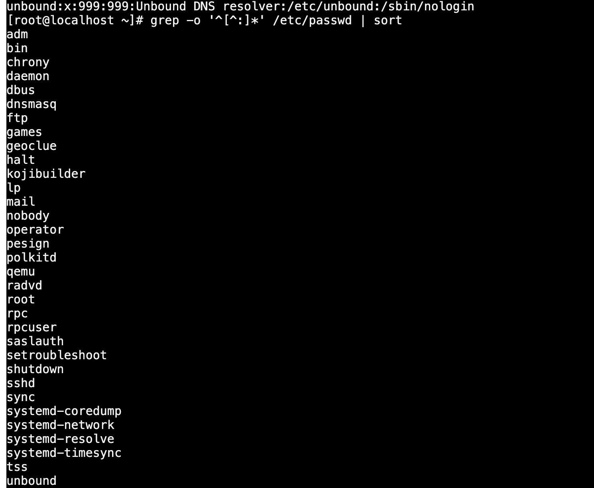
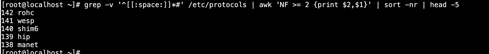

# Практическая работа №1

## задача 1
```bash
grep -o '^[^:]*' /etc/passwd | sort
```

## задача 2
```bash
grep -v '^[[:space:]]*#' /etc/protocols | awk 'NF >= 2 {print $2, $1}' | sort -nr | head -5
```
