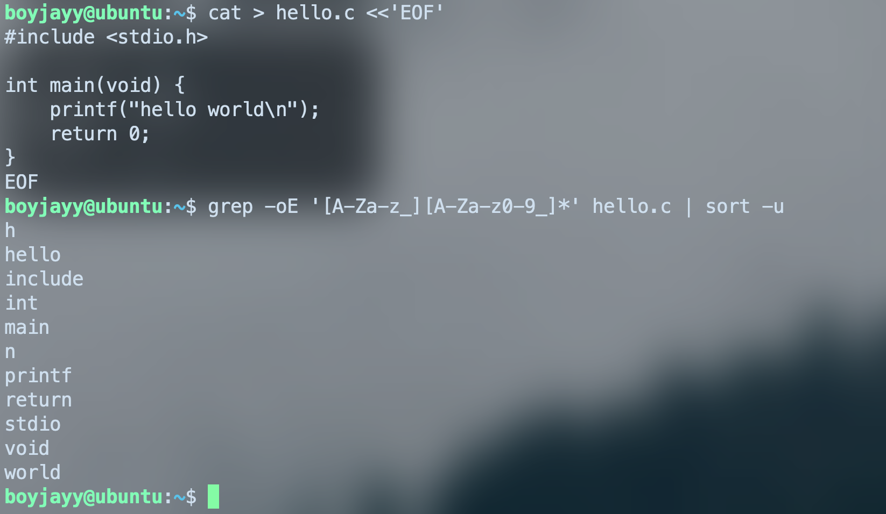
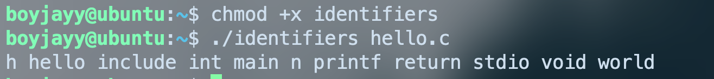
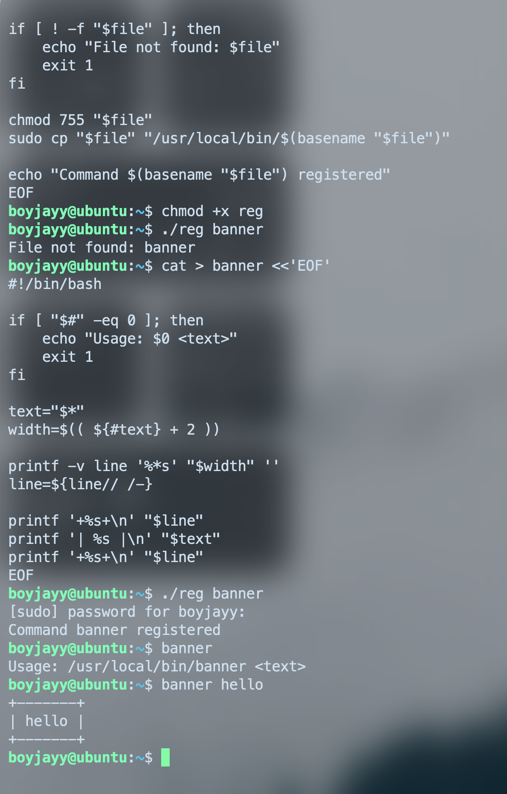
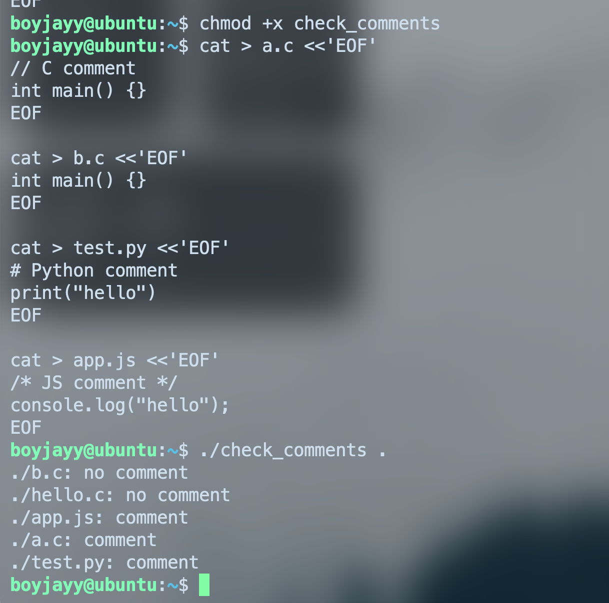
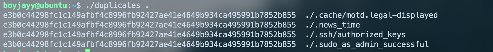

# Практическая работа №1

## задача 1
```bash
grep -o '^[^:]*' /etc/passwd | sort
```

## задача 2
```bash
grep -v '^[[:space:]]*#' /etc/protocols | awk 'NF >= 2 {print $2, $1}' | sort -nr | head -5
```

## задача 3
```bash
cat > banner <<'EOF'
#!/bin/bash

if [ "$#" -eq 0 ]; then
    echo "Usage: $0 <text>"
    exit 1
fi

text="$*"
width=$(( ${#text} + 2 ))

printf -v line '%*s' "$width" ''
line=${line// /-}

printf '+%s+\n' "$line"
printf '| %s |\n' "$text"
printf '+%s+\n' "$line"
EOF
```
после этого будет работать 
```bash

./banner

```

## задача 4

``` bass
grep -oE '[A-Za-z_][A-Za-z0-9_]*' hello.c | sort -u | tr '\n' ' '
``` 
-o выводить только найденные совпадения
-E использовать расширенные регулярные выражения


```bash
cat > identifiers <<'EOF'
#!/bin/bash

if [ "$#" -ne 1 ]; then
    echo "Usage: $0 <file>"
    exit 1
fi

grep -oE '[A-Za-z_][A-Za-z0-9_]*' "$1" | sort -u | tr '\n' ' '
echo
EOF
```
после работает так


## задача 5

```bash
cat > reg <<'EOF'
#!/bin/bash

if [ "$#" -ne 1 ]; then
    echo "Usage: $0 <file>"
    exit 1
fi

file="$1"

if [ ! -f "$file" ]; then
    echo "File not found: $file"
    exit 1
fi

chmod 755 "$file"
sudo cp "$file" "/usr/local/bin/$(basename "$file")"

echo "Command $(basename "$file") registered"
EOF
```




## задача 6

```bash
cat > check_comments <<'EOF'
#!/bin/bash

if [ "$#" -ne 1 ]; then
    echo "Usage: $0 <directory>"
    exit 1
fi

dir="$1"

if [ ! -d "$dir" ]; then
    echo "Directory not found: $dir"
    exit 1
fi

find "$dir" -type f \( -name '*.c' -o -name '*.js' -o -name '*.py' \) | while read -r file; do
    first=$(head -n 1 "$file")

    case "$file" in
        *.py)
            if [[ "$first" =~ ^[[:space:]]*# ]]; then
                echo "$file: comment"
            else
                echo "$file: no comment"
            fi
            ;;

        *.c|*.js)
            if [[ "$first" =~ ^[[:space:]]*(//|/\*) ]]; then
                echo "$file: comment"
            else
                echo "$file: no comment"
            fi
            ;;
    esac
done
EOF
```



## задача 7 (перед началом рекомендую ознакомиться со своей реализацией sha256 https://github.com/BoyJayy/image-similarity-lab/blob/main/src/sha256impl.cpp)

```bash
cat > duplicates <<'EOF'
#!/bin/bash

if [ "$#" -ne 1 ]; then
    echo "Usage: $0 <directory>"
    exit 1
fi

dir="$1"

if [ ! -d "$dir" ]; then
    echo "Directory not found: $dir"
    exit 1
fi

find "$dir" -type f -exec sha256sum {} + |
sort |
uniq -w 64 --all-repeated=separate
EOF
```




# задача 8

```bash

```
